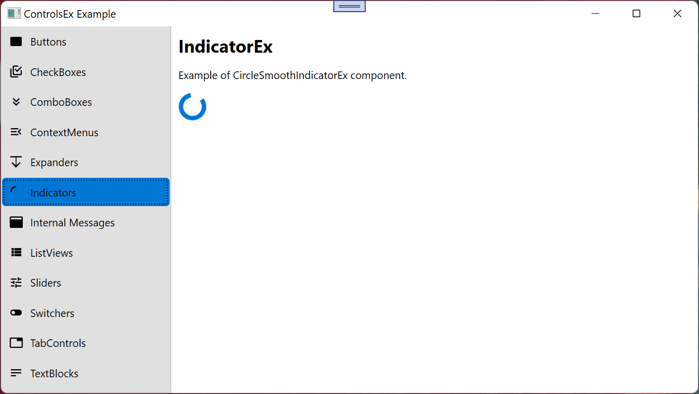

# CircleSmoothIndicatorEx
Inherited from _[BaseIndicatorEx](BaseIndicatorEx.md)_ and _INotifyPropertyChanged_.

namespace: _chkam05.Tools.ControlsEx.Indicators_

### Additional Attributes:

| Type           | Name                   | Description |
|:--------------:|:----------------------:|:------------|
| double         | IndicatorThickness     | Indicator thickness. |
|||
|||
| **Get only**:  ||
| bool           | IsPathEditable         | Parameter that defines if geomatry path is editable (default false). |
| Point          | InnerArcEndPoint       | Indicator inner arc end point. |
| bool           | InnerArcLarge          | Indicator inner arc flip side. |
| double         | InnerArcRotationAngle  | Indicator inner arc rotation angle. |
| Size           | InnerArcSize           | Indicator inner arc size. |
| Point          | InnerArcStartPoin      | Indicator inner arc start point. |
| SweepDirection | InnerArcSweepDirection | Indicator inner arc sweep direction. |
| Point          | OuterArcEndPoint       | Indicator outer arc end point. |
| bool           | OuterArcLarge          | Indicator outer arc flip side. |
| double         | OuterArcRotationAngle  | Indicator outer arc rotation angle. |
| Size           | OuterArcSize           | Indicator outer arc size. |
| Point          | OuterArcStartPoin      | Indicator outer arc start point. |
| SweepDirection | OuterArcSweepDirection | Indicator outer arc sweep direction. |
| Geometry       | PathData               | Indicator drawing path. |

### Additional Constructors:

- _None_

### Additional Events:

- _None_

### Additional Methods:

- _None_
