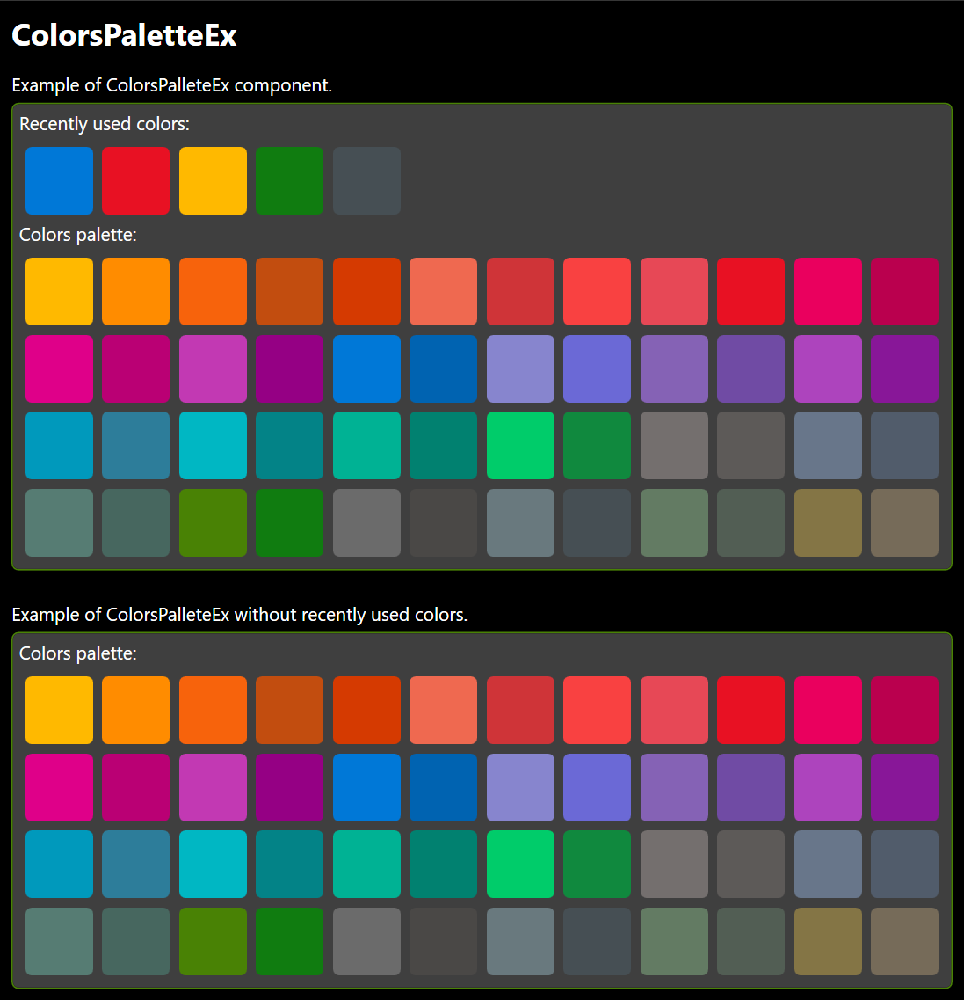

# ColorsPaletteEx
Colors Palette Control inherited from _Control_ and _INotifyPropertyChanged_.

namespace: _chkam05.Tools.ControlsEx_

### Additional Attributes:

| Type             | Name                                 | Description |
|:-----------------|:-------------------------------------|:------------|
| Brush            | ColorItemMouseOverBackground         | Color item background color when cursor is over. |
| Brush            | ColorItemMouseOverBorderBrush        | Color item border color when cursor is over. |
| Brush            | ColorItemSelectedBackground          | Color item background color when is selected. |
| Brush            | ColorItemSelectedBorderBrush         | Color item border color when is selected. |
| Brush            | ColorItemSelectedInactiveBackground  | Color item background color when is selected, when ColorsPalette control is not focused. |
| Brush            | ColorItemSelectedInactiveBorderBrush | Color item border color when is selected, when ColorsPalette control is not focused. |
|||
| CornerRadius     | ColorItemCornerRadius                | Color item corner radius. |
| double           | ColorItemHeight                      | Color item height. |
| bool             | ColorItemKeepSelected                | Keep color item visually selected after selecting it. |
| Thickness        | ColorItemMargin                      | Color item margin (space between items). |
| Thickness        | ColorItemPadding                     | Color item padding (space between color and color item border). |
| double           | ColorItemWidth                       | Color item width. |
|||
| ObservableCollection<[ColorPaletteItem](ColorPaletteItem.md)> | Colors         | Collection of colors available to select in palette. |
| ObservableCollection<[ColorPaletteItem](ColorPaletteItem.md)> | ColorsHistory  | Collection of last selected colors in palette. |
| bool             | ColorsHistoryEnabled                 | Show list of last selected colors. |
| int              | ColorsHistoryCount                   | Last selected colors count. |
| string           | ColorsHistoryTitle                   | Title above list of last selected colors. |
| [ColorPaletteItem](ColorPaletteItem.md) | SelectedColorItem | Currently selected color item. |
| string           | Title                                | Title above list of available colors to select in palette. |

### Additional Constructors:

- _None_

### Additional Events:

| Type                          | Name             | Description |
|:------------------------------|:-----------------|:------------|
| PropertyChangedEventHandler   | PropertyChanged  | Event invoked after changing property. |
| ColorsPalleteSelectionChanged | PropertyChanged  | Event invoked after selecting color. |

### Additional Methods:

- **AddColor**  
Add color item to colors palette.

| Type   | Parameter Name | Description |
|:-------|:---------------|:------------|
| [ColorPaletteItem](ColorPaletteItem.md) | colorPaletteItem | Color palette item. |

- **AddColorToHistory**  
Add color item to history colors palette.

| Type   | Parameter Name | Description |
|:-------|:---------------|:------------|
| [ColorPaletteItem](ColorPaletteItem.md) | colorPaletteItem | Color palette item. |

- **InsertColor**  
Insert color item to colors palette.

| Type   | Parameter Name | Description |
|:-------|:---------------|:------------|
| [ColorPaletteItem](ColorPaletteItem.md) | colorPaletteItem | Color palette item. |
| int    | index          | Index of place where color palette item will be inserted. |

- **InsertColorToHistory**  
Insert color item to history colors palette.

| Type   | Parameter Name | Description |
|:-------|:---------------|:------------|
| [ColorPaletteItem](ColorPaletteItem.md) | colorPaletteItem | Color palette item. |
| int    | index          | Index of place where color palette item will be inserted. |

- **RemoveColor**  
Remove color item from colors palette

| Type   | Parameter Name | Description |
|:-------|:---------------|:------------|
| [ColorPaletteItem](ColorPaletteItem.md) | colorPaletteItem | Color palette item to remove. |

- **RemoveColorFromHistory**  
Remove color item from history colors palette

| Type   | Parameter Name | Description |
|:-------|:---------------|:------------|
| [ColorPaletteItem](ColorPaletteItem.md) | colorPaletteItem | Color palette item to remove. |

- **RemoveColorAt**  
Remove color item from colors palette, located at specified index.

| Type   | Parameter Name | Description |
|:-------|:---------------|:------------|
| int    | index          | Index of color palette item to remove. |

- **RemoveColorFromHistoryAt**  
Remove color item from history colors palette, located at specified index.

| Type   | Parameter Name | Description |
|:-------|:---------------|:------------|
| int    | index          | Index of color palette item to remove. |

### Const:

| Type | Name                     | Description |
|:-----|:-------------------------|:------------|
| int  | MAX_COLORS_HISTORY_COUNT | Max amount of history (last selected) colors. |
