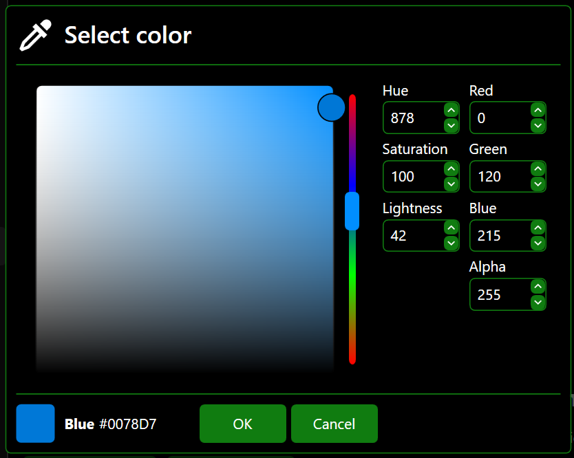

# ColorsPickerInternalMessageEx
Extended Colors Picker Internal Message inherited from _[BaseColorSelectorInternalMessageEx](BaseColorSelectorInternalMessageEx.md)_.

namespace: _chkam05.Tools.ControlsEx.InternalMessages_

### Additional Attributes:

| Type  | Name                                 | Description |
|:------|:-------------------------------------|:------------|
| Brush | ColorComponentMouseOverBackground    |  |
| Brush | ColorComponentMouseOverBorderBrush   |  |
| Brush | ColorComponentMouseOverForeground    |  |
| Brush | ColorComponentSelectedBackground     |  |
| Brush | ColorComponentSelectedBorderBrush    |  |
| Brush | ColorComponentSelectedForeground     |  |
| Brush | ColorComponentSelectedTextBackground |  |
||||
| int   | AlphaComponent                       |  |
| int   | RedComponent                         |  |
| int   | GreenComponent                       |  |
| int   | BlueComponent                        |  |
| int   | HueComponent                         |  |
| int   | SaturationComponent                  |  |
| int   | LightnessComponent                   |  |

### Additional Constructors:

| Type                  | Parameter Name | Description |
|:----------------------|:---------------|:------------|
| [InternalMessagesExContainer](InternalMessagesExContainer.md) | parentContainer | Internal messages ex container where message will be displayed. |
| string                | title          | Internal message title. |
| PackIconKind          | icon           | Internal message icon kind (see related repositories). |

### Additional Events:

- _None_

### Additional Methods:

- _None_

### Related components:

- [InternalMessagesExContainer](InternalMessagesExContainer.md)  
Is default container component for InternalMessageEx components.
