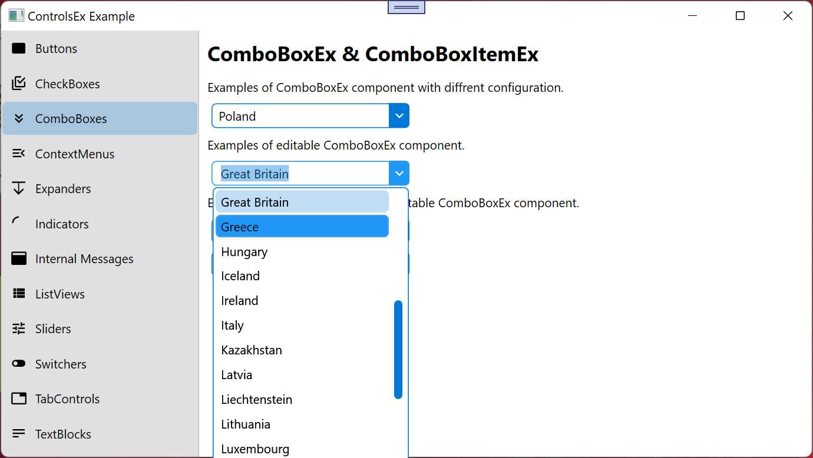

# ComboBoxEx
Extended ComboBox Control inherited from _ComboBox_ and _INotifyPropertyChanged_.

namespace: _chkam05.Tools.ControlsEx_

### Additional Attributes:

| Type         | Name                       | Description |
|:-------------|:---------------------------|:------------|
| Brush        | DropDownBackground         | ComboBox dropdown menu background color. |
| Brush        | DropDownBorderBrush        | ComboBox dropdown menu border color. |
| Brush        | DropDownForeground         | ComboBox dropdown menu foreground color. |
| Brush        | DropDownIconBrush          | ComboBox dropdown button icon color. |
| Brush        | DropDownMouseOverIconBrush | ComboBox dropdown button icon color when cursor is over. |
| Brush        | DropDownSelectedIconBrush  | ComboBox dropdown button icon color when is pressed. |
| Brush        | MouseOverBackground        | ComboBox background color when cursor is over. |
| Brush        | MouseOverBorderBrush       | ComboBox border color when cursor is over. |
| Brush        | MouseOverForeground        | ComboBox foreground color when cursor is over. |
| Brush        | SelectedBackground         | ComboBox background color when component is focused. |
| Brush        | SelectedBorderBrush        | ComboBox border color when component is focused. |
| Brush        | SelectedForeground         | ComboBox foregroud color when component is focused. |
||||
| CornerRadius | ButtonCornerRadius         | ComboBox dropdown button corner radius. |
| CornerRadius | CornerRadius               | ComboBox corner radius. |
| CornerRadius | DropDownCornerRadius       | ComboBox dropdown border thickness. |
| Thickness    | DropDownBorderThickness    | ComboBox dropdown corner radius. |

### Additional Constructors:

- _None_

### Additional Events:

| Type                        | Name             | Description |
|:----------------------------|:-----------------|:------------|
| PropertyChangedEventHandler | PropertyChanged  | Event invoked after changing property. |

### Additional Methods:

- _None_

### Related components:

- [ComboBoxItemEx](ComboBoxItemEx.md)  
Is default item component for ComboBoxEx component.

# Related repositories 

materialdesigninxaml (PackIconKind): https://github.com/MaterialDesignInXAML/MaterialDesignInXamlToolkit  
_Used as ComboBox dropdown Button_
