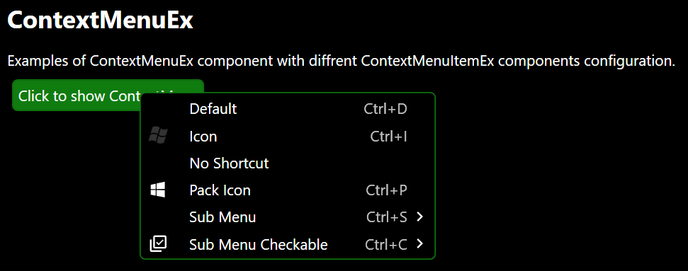

# ContextMenuEx
Extended ContextMenu Control inherited from _ContextMenu_ and _INotifyPropertyChanged_.

namespace: _chkam05.Tools.ControlsEx_

### Additional Attributes:

| Type         | Name         | Description |
|:-------------|:-------------|:------------|
| CornerRadius | CornerRadius | ContextMenu corner radius. |

### Additional Constructors:

- _None_

### Additional Events:

| Type                        | Name             | Description |
|:----------------------------|:-----------------|:------------|
| PropertyChangedEventHandler | PropertyChanged  | Event invoked after changing property. |

### Additional Methods:

- _None_

### Related components:

- [ContextMenuItemEx](ContextMenuItemEx.md)  
Is default item component for ContextMenuEx component.
