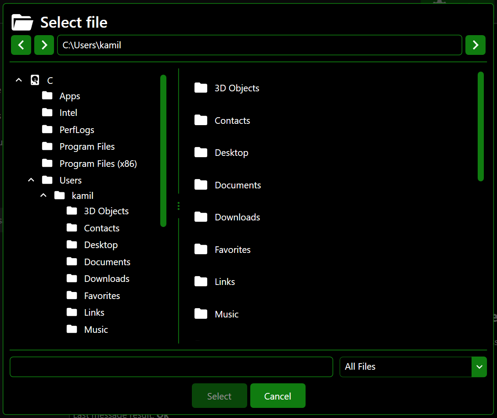

# FilesSelectorInternalMessageEx
Extended Files Selector Internal Message inherited from _[BaseFilesSelectorInternalMessageEx](BaseFilesSelectorInternalMessageEx.md)_.

namespace: _chkam05.Tools.ControlsEx.InternalMessages_

### Additional Attributes:

| Type | Name | Description |
|:-----|:-----|:------------|
| ObservableCollection<[InternalMessageFileItem](InternalMessageFileItem.md)>         | Files | Collection of loaded files and directories in main files list view. |
| ObservableCollection<[InternalMessageFileTreeItem](InternalMessageFileTreeItem.md)> | Tree  | Collection of loaded directories in directories tree view. |

### Constructors:

| Type                  | Parameter Name | Description |
|:----------------------|:---------------|:------------|
| [InternalMessagesExContainer](InternalMessagesExContainer.md) | parentContainer | Internal messages ex container where message will be displayed. |
| string                | title          | Internal message title. |
| PackIconKind          | icon           | Internal message icon kind (see related repositories). |

### Additional Events:

- _None_

### Additional Methods:

- **CreateOpenFileInternalMessageEx**  
Create files selector internal message as open file with preset configuration.

| Type         | Parameter Name | Description |
|:-------------|:---------------|:------------|
| string       | title          | Internal message title. |
| PackIconKind | icon           | Internal message icon kind (see related repositories). |

- **CreateSaveFileInternalMessageEx**  
Create files selector internal message as save file with preset configuration.

| Type         | Parameter Name | Description |
|:-------------|:---------------|:------------|
| string       | title          | Internal message title. |
| PackIconKind | icon           | Internal message icon kind (see related repositories). |

- **CreateSelectDirectoryInternalMessageEx**  
Create files selector internal message as select directory with preset configuration.

| Type         | Parameter Name | Description |
|:-------------|:---------------|:------------|
| string       | title          | Internal message title. |
| PackIconKind | icon           | Internal message icon kind (see related repositories). |

### Related components:

- [InternalMessagesExContainer](InternalMessagesExContainer.md)  
Is default container component for InternalMessageEx components.

# Related repositories

materialdesigninxaml (PackIconKind): https://github.com/MaterialDesignInXAML/MaterialDesignInXamlToolkit
