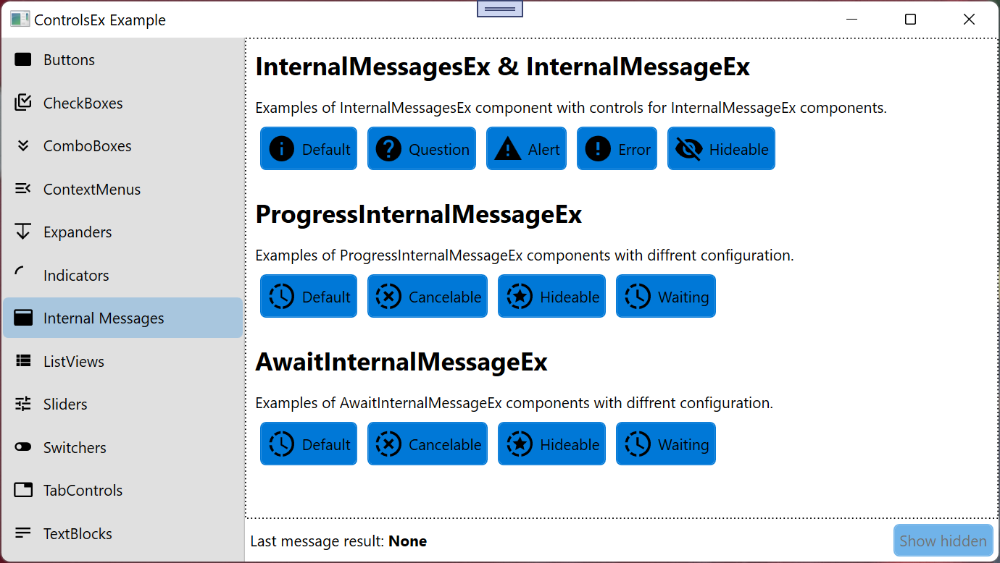
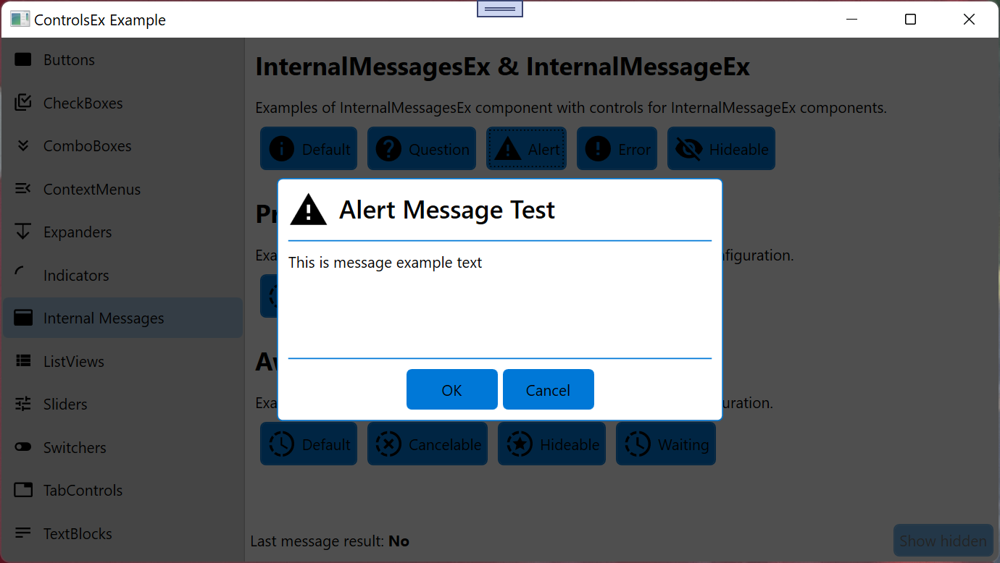
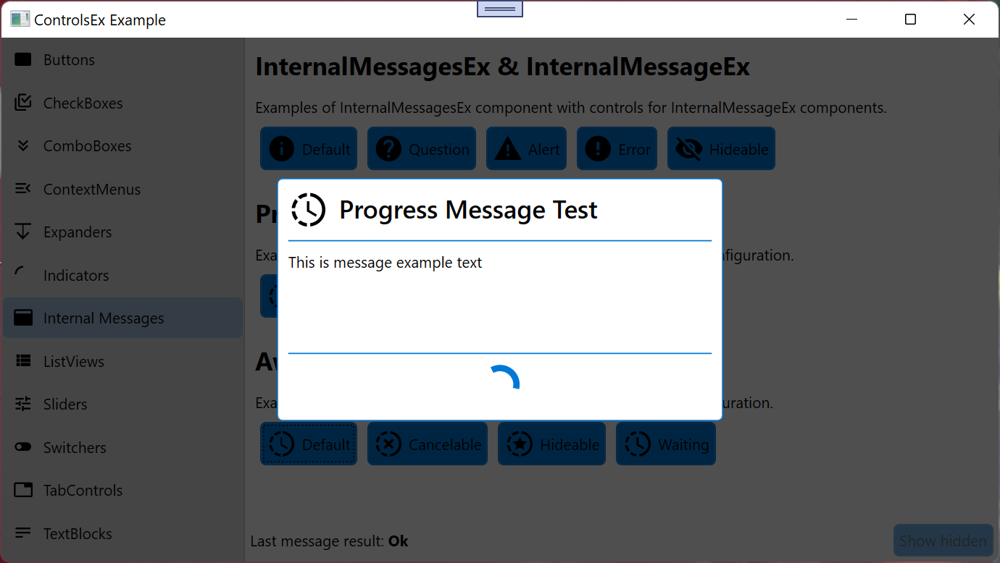
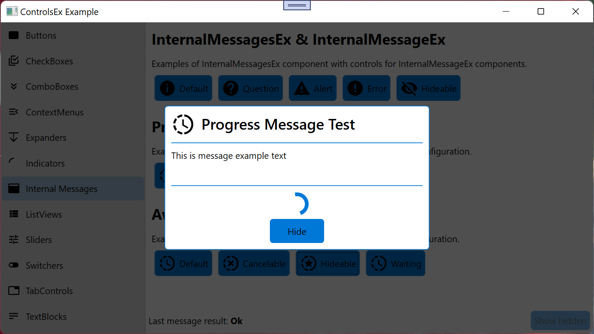
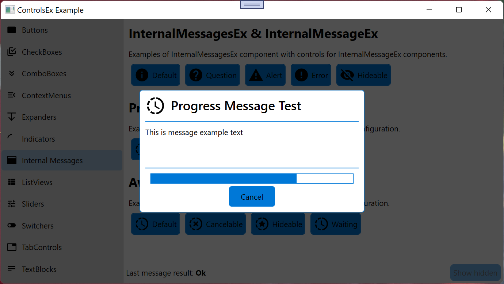
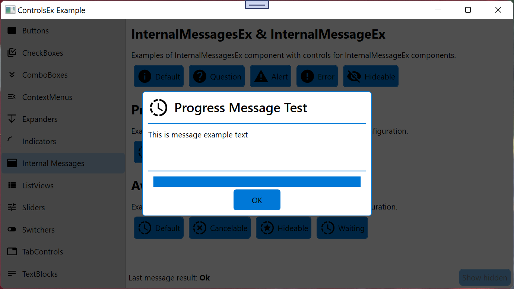
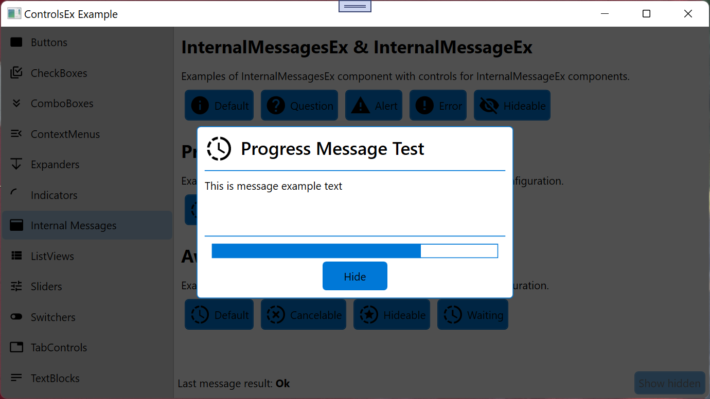

# InternalMessagesEx
InternalMessagesEx Control inherited from _Frame_ and _INotifyPropertyChanged_.  

namespace: _chkam05.Tools.ControlsEx.InternalMessagesEx_  

  

### Additional Attributes:

| Type                  | Name                 | Description |
|:---------------------:|:--------------------:|:------------|
| bool                  | CanGoBack            | If InternalMessagesEx can load previous message. |
| bool                  | HasHidden            | If InternalMessagesEx contains hidden messages. |
| BaseInternalMessageEx | Message              | InternalMessagesEx current loaded message. |
| int                   | MessageIndex         | InternalMessagesEx current loaded message index. |

### Additional Constructors: 

- _None_  

### Additional Events: 

| Type                        | Name             | Description                            |
|:---------------------------:|:----------------:|:---------------------------------------|
| PropertyChangedEventHandler | PropertyChanged  | Event invoked after property changed.  |

### Additional Methods: 

| Type                        | Name                         | Parameters | Description |
|:---------------------------:|:----------------------------:|:----------------------------------------------:|:---------------------------------------|
| InternalMessageEx           | CreateDefaultMessage         | string title, string message, PackIconKind icon, InternalMessageButtons buttons, InternalMessageClose onClose, InternalMessageHide onHide | Create CreateDefaultMessage message.  |
| ProgressInternalMessageEx   | CreateDefaultProgressMessage | string title, string message, PackIconKind icon, InternalMessageClose onClose, InternalMessageHide onHide                                      | Create CreateDefaultProgressMessage message.  |
| AwaitInternalMessageEx      | CreateDefaultAwaitMessage    | string title, string message, PackIconKind icon, IndicatorType indicatorType, InternalMessageClose onClose, InternalMessageHide onHide    | Create CreateDefaultAwaitMessage message.  |
|||
| void | ShowHidden   |                               | Show last hidden message. |
| void | CloseMessage | bool forceCloseAll            | Close current message. |
| void | GoBack       |                               | Load previous message. |
| void | LoadMessage  | BaseInternalMessageEx message | Load message. |

# BaseInternalMessageEx
BaseInternalMessageEx Control inherited from _Page_ and _INotifyPropertyChanged_.  

namespace: _chkam05.Tools.ControlsEx.InternalMessages.BaseInternalMessageEx_  

### Additional Attributes:

| Type   | Name                 | Description |
|:------:|:--------------------:|:------------|
| Brush  | BorderBrush          | BaseInternalMessageEx border color. |
|||
| double       | IconHeight       | BaseInternalMessageEx icon height. |
| PackIconKind | PackIconKind     | BaseInternalMessageEx icon (see related repositories). |
| Thickness    | IconMargin       | BaseInternalMessageEx icon margin. |
| double       | IconMaxHeight    | BaseInternalMessageEx icon max height. |
| double       | IconMaxWidth     | BaseInternalMessageEx icon max width. |
| double       | IconMinHeight    | BaseInternalMessageEx icon min height. |
| double       | IconMinWidth     | BaseInternalMessageEx icon min width. |
| double       | IconWidth        | BaseInternalMessageEx icon width. |
|||
| FontFamily   | TitleFontFamily  | BaseInternalMessageEx title font family. |
| double       | TitleFontSize    | BaseInternalMessageEx title font size. |
| FontStretch  | TitleFontStretch | BaseInternalMessageEx title font stretch. |
| FontStyle    | TitleFontStyle   | BaseInternalMessageEx title font style. |
| FontWeight   | TitleFontWeight  | BaseInternalMessageEx title font weight. |
|||
| bool                   | AllowHide       | Allow to hide BaseInternalMessageEx when it appears. |
| Thickness              | BorderThickness | BaseInternalMessageEx border thickness. | 
| InternalMessageButtons | Buttons         | BaseInternalMessageEx buttons set. | 
| CornerRadius           | CornerRadius    | BaseInternalMessageEx corner radius. | 
| bool                   | IsHidden        | BaseInternalMessageEx is hidden. | 
| Thickness              | Padding         | BaseInternalMessageEx padding. | 
| InternalMessageResult  | Result          | BaseInternalMessageEx result after closing. | 
| InternalMessageResult  | Result          | BaseInternalMessageEx result after closing. | 

### Additional Constructors: 

- _None_  

### Additional Events: 

| Type                        | Name             | Description                            |
|:---------------------------:|:----------------:|:---------------------------------------|
| PropertyChangedEventHandler | PropertyChanged  | Event invoked after property changed.  |
| InternalMessageClose        | MessageClose     | Event invoked after closing BaseInternalMessageEx.  |
| InternalMessageHide         | MessageHide      | Event invoked after hiding and showing BaseInternalMessageEx.  |

### Additional Methods: 

- _None_  

# IProgressInternalMessageEx
IProgressInternalMessageEx interface.  

namespace: _chkam05.Tools.ControlsEx.InternalMessages.IProgressInternalMessageEx_  

### Attributes:

| Type          | Name                    | Description |
|:-------------:|:-----------------------:|:------------|
| double        | ProgressMax             | BaseProgressInternalMessageEx progress max value. |
| double        | ProgressMin             | BaseProgressInternalMessageEx progress min value. |
| double        | Progress                | BaseProgressInternalMessageEx progress value. |
|||
| bool          | AllowCancel             | Allow cancel BaseProgressInternalMessageEx progress. |
| bool          | KeepOnScreenCompleted   | Leave BaseProgressInternalMessageEx opened after progress finish. |
| **Get only**  ||
| bool          | IsFinished              | Is BaseProgressInternalMessageEx progress finished. |

### Events:

| Type                          | Name             | Description                            |
|:-----------------------------:|:----------------:|:---------------------------------------|
| InternalMessageClose          | MessageClose     | Event invoked after closing progress message.  |
| ProgressInternalMessageCancel | MessageHide      | Event invoked after canceling progress.  |

### Methods: 

| Type  | Name                 | Parameters                        | Description |
|:-----:|:--------------------:|:---------------------------------:|:------------|
| void  | InvokeProgressChange | double progress                   | Method for send progress update to user interface.  |
| void  | InvokeFinish         | InternalMessageResult forceResult | Ivoke finish progress.  |

# BaseAwaitInternalMessageEx
BaseAwaitInternalMessageEx Control inherited from _BaseInternalMessageEx_, _IProgressInternalMessageEx_ and _INotifyPropertyChanged_.  

namespace: _chkam05.Tools.ControlsEx.InternalMessages.BaseAwaitInternalMessageEx_  

### Additional Attributes:

| Type          | Name                    | Description |
|:-------------:|:-----------------------:|:------------|
| TimeSpan      | IndicatorAnimationSpeed | BaseAwaitInternalMessageEx indicator animation frame change speed. |
| Brush         | IndicatorFill           | BaseAwaitInternalMessageEx indicator fill color. |
| Thickness     | IndicatorPenThickness   | BaseAwaitInternalMessageEx indicator pen thickness. |
| IndicatorType | IndicatorType           | BaseAwaitInternalMessageEx indicator type. |
|||
| double        | ProgressMax             | BaseAwaitInternalMessageEx progress max value. |
| double        | ProgressMin             | BaseAwaitInternalMessageEx progress min value. |
| double        | Progress                | BaseAwaitInternalMessageEx progress value. |
|||
| bool                | AllowCancel           | Allow cancel BaseAwaitInternalMessageEx progress. |
| bool                | KeepOnScreenCompleted | Leave BaseAwaitInternalMessageEx opened after progress finish. |
| **Get only**        ||
| BaseIndicatorEx     | Indicator             | BaseAwaitInternalMessageEx loaded indicator. |
| DispatcherInvokerEx | DispatcherInvoker     | Dispatcher invoker for invoke progress methods running on separate thread. |
| bool                | IsFinished            | Is BaseAwaitInternalMessageEx progress finished. |

### Additional Constructors: 

- _None_  

### Additional Events: 

| Type                          | Name             | Description                            |
|:-----------------------------:|:----------------:|:---------------------------------------|
| InternalMessageClose          | MessageClose     | Event invoked after closing BaseAwaitInternalMessageEx.  |
| ProgressInternalMessageCancel | MessageHide      | Event invoked after canceling progress.  |

### Additional Methods: 

| Type  | Name                 | Parameters                        | Description |
|:-----:|:--------------------:|:---------------------------------:|:------------|
| void  | InvokeProgressChange | double progress                   | Method for send progress update to user interface.  |
| void  | InvokeFinish         | InternalMessageResult forceResult | Ivoke finish progress.  |

# BaseProgressInternalMessageEx
BaseProgressInternalMessageEx Control inherited from _BaseInternalMessageEx_, _IProgressInternalMessageEx_ and _INotifyPropertyChanged_.  

namespace: _chkam05.Tools.ControlsEx.InternalMessages.BaseProgressInternalMessageEx_  

### Additional Attributes:

| Type          | Name                    | Description |
|:-------------:|:-----------------------:|:------------|
| double        | ProgressMax             | BaseProgressInternalMessageEx progress max value. |
| double        | ProgressMin             | BaseProgressInternalMessageEx progress min value. |
| double        | Progress                | BaseProgressInternalMessageEx progress value. |
|||
| bool          | AllowCancel             | Allow cancel BaseProgressInternalMessageEx progress. |
| bool          | KeepOnScreenCompleted   | Leave BaseProgressInternalMessageEx opened after progress finish. |
| **Get only**  ||
| bool          | IsFinished              | Is BaseProgressInternalMessageEx progress finished. |

### Additional Constructors: 

- _None_  

### Additional Events: 

| Type                          | Name             | Description                            |
|:-----------------------------:|:----------------:|:---------------------------------------|
| InternalMessageClose          | MessageClose     | Event invoked after closing BaseProgressInternalMessageEx.  |
| ProgressInternalMessageCancel | MessageHide      | Event invoked after canceling progress.  |

### Additional Methods: 

| Type  | Name                 | Parameters                        | Description |
|:-----:|:--------------------:|:---------------------------------:|:------------|
| void  | InvokeProgressChange | double progress                   | Method for send progress update to user interface.  |
| void  | InvokeFinish         | InternalMessageResult forceResult | Ivoke finish progress.  |

# InternalMessageEx
InternalMessageEx Control inherited from _BaseInternalMessageEx_.  

namespace: _chkam05.Tools.ControlsEx.InternalMessages.InternalMessageEx_  

  
  
  

### Additional Attributes:

| Type   | Name    | Description |
|:------:|:-------:|:------------|
| string | Message | InternalMessageEx message. |

### Additional Constructors: 

- _None_  

### Additional Events: 

- _None_  

### Additional Methods: 

- _None_  

# AwaitInternalMessageEx
AwaitInternalMessageEx Control inherited from _BaseAwaitInternalMessageEx_.  

namespace: _chkam05.Tools.ControlsEx.InternalMessages.AwaitInternalMessageEx_  

  
  

### Additional Attributes:

| Type   | Name    | Description |
|:------:|:-------:|:------------|
| string | Message | AwaitInternalMessageEx message. |

### Additional Constructors: 

- _None_  

### Additional Events: 

- _None_  

### Additional Methods: 

- _None_  

# ProgressInternalMessageEx
ProgressInternalMessageEx Control inherited from _BaseProgressInternalMessageEx_.  

namespace: _chkam05.Tools.ControlsEx.InternalMessages.ProgressInternalMessageEx_  

  
  
  
  

### Additional Attributes:

| Type   | Name    | Description |
|:------:|:-------:|:------------|
| string | Message | AwaitInternalMessageEx message. |

### Additional Constructors: 

- _None_  

### Additional Events: 

- _None_  

### Additional Methods: 

- _None_  

# Related repositories 

materialdesigninxaml (PackIconKind): https://github.com/MaterialDesignInXAML/MaterialDesignInXamlToolkit  
_Used in header icon_  
