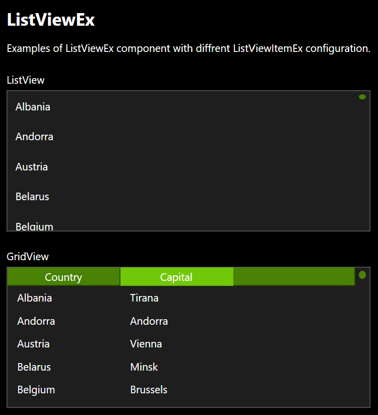

# ListViewEx
Extended ListView Control inherited from _ListView_ and _INotifyPropertyChanged_.

namespace: _chkam05.Tools.ControlsEx_

### Additional Attributes:

| Type         | Name                             | Description |
|:-------------|:---------------------------------|:------------|
| Brush        | ColumnHeaderBackground           | ListViewEx column header background color. |
| Brush        | ColumnHeaderBorderBrush          | ListViewEx column header border color. |
| Brush        | ColumnHeaderForeground           | ListViewEx column header foreground color. |
| Brush        | ColumnHeaderMouseOverBackground  | ListViewEx column header background color when cursor is over. |
| Brush        | ColumnHeaderMouseOverBorderBrush | ListViewEx column header border color when cursor is over. |
| Brush        | ColumnHeaderMouseOverForeground  | ListViewEx column header foreground color when cursor is over. |
| Brush        | ColumnHeaderPressedBackground    | ListViewEx column header background color when is pressed. |
| Brush        | ColumnHeaderPressedBorderBrush   | ListViewEx column header border color when is pressed. |
| Brush        | ColumnHeaderPressedForeground    | ListViewEx column header foreground color when is pressed. |
| Brush        | ColumnHeaderEmptyBackground      | ListViewEx column header background color for empty space. |
| Brush        | ColumnHeaderEmptyBorderBrush     | ListViewEx column header border color for empty space. |
||||
| Thickness    | ColumnHeaderBorderThickness      | ListViewEx column header border thickness. |
| CornerRadius | ColumnHeaderCornerRadius         | ListViewEx column header corner radius. |
| double       | ColumnHeaderGripperWidth         | ListViewEx column header gripper width. |
| Thickness    | ColumnHeaderMargin               | ListViewEx column header margin. |
| Thickness    | ColumnHeaderPadding              | ListViewEx column header padding. |
| CornerRadius | CornerRadius                     | ListViewEx corener radius. |

### Additional Constructors:

- _None_

### Additional Events:

| Type                        | Name             | Description |
|:----------------------------|:-----------------|:------------|
| PropertyChangedEventHandler | PropertyChanged  | Event invoked after changing property. |

### Additional Methods:

- _None_

### Related components:

- [ListViewItemEx](ListViewItemEx.md)  
Is default item component for ListViewEx component.
