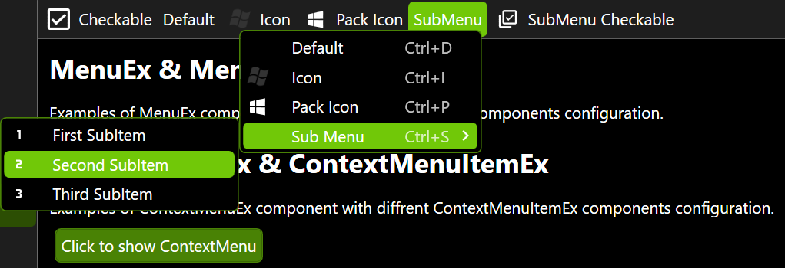
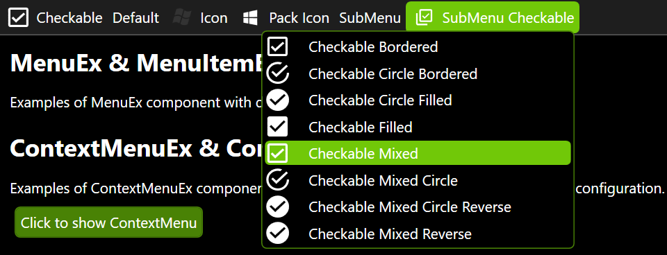

# MenuItemEx
Extended MenuItem Control inherited from _MenuItem_ and _INotifyPropertyChanged_.

namespace: _chkam05.Tools.ControlsEx_

### Additional Attributes:

| Type          | Name                   | Description |
|:--------------|:-----------------------|:------------|
| Brush         | CheckMarkColorBrush    | MenuItemEx check mark color. |
| Brush         | IconColorBrush         | MenuItemEx icon color. |
| Brush         | MouseOverBackground    | MenuItemEx background color when cursor is over. |
| Brush         | MouseOverBorderBrush   | MenuItemEx border color when cursor is over. |
| Brush         | MouseOverForeground    | MenuItemEx foreground color when cursor is over. |
||||
| [CheckBoxStyle](CheckBoxStyle.md) | CheckBoxStyle | MenuItemEx checkbox style. |
| double        | CheckMarkHeight        | MenuItemEx checkbox height. |
| Thickness     | CheckMarkMargin        | MenuItemEx checkbox margin. |
| double        | CheckMarkMaxHeight     | MenuItemEx checkbox max height. |
| double        | CheckMarkMaxWidth      | MenuItemEx checkbox max width. |
| double        | CheckMarkMinHeight     | MenuItemEx checkbox min height. |
| double        | CheckMarkMinWidth      | MenuItemEx checkbox min width. |
| double        | CheckMarkWidth         | MenuItemEx checkbox width. |
||||
| double        | IconHeight             | MenuItemEx icon height. |
| PackIconKind  | IconKind               | MenuItemEx icon (see related repositories). |
| Thickness     | IconMargin             | MenuItemEx icon margin. |
| double        | IconMaxHeight          | MenuItemEx icon max height. |
| double        | IconMaxWidth           | MenuItemEx icon max width. |
| double        | IconMinHeight          | MenuItemEx icon min height. |
| double        | IconMinWidth           | MenuItemEx icon min width. |
| double        | IconWidth              | MenuItemEx icon width. |
||||
| CornerRadius  | CornerRadius           | MenuItemEx corner radius. |

### Additional Constructors:

- _None_

### Additional Events:

| Type                        | Name             | Description |
|:----------------------------|:-----------------|:------------|
| PropertyChangedEventHandler | PropertyChanged  | Event invoked after changing property. |

### Additional Methods:

- _None_

### Related components:

- [MenuEx](MenuEx.md)  
Is default container component for MenuItemEx component.

# Related repositories 

materialdesigninxaml (PackIconKind): https://github.com/MaterialDesignInXAML/MaterialDesignInXamlToolkit  
_Used as CheckBox Mark and Icon in MenuItemEx_
