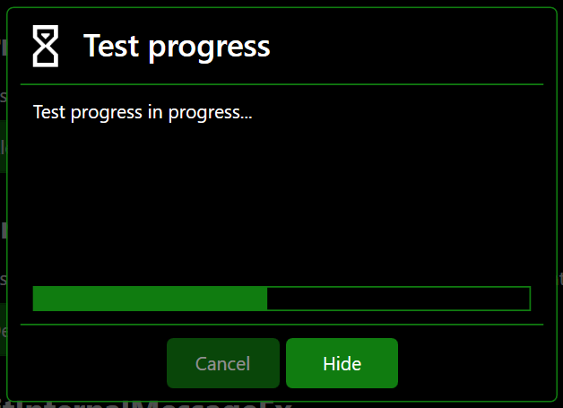

# ProgressInternalMessageEx
Extended Progress Internal Message inherited from _[BaseProgressInternalMessageEx](BaseProgressInternalMessageEx.md)_.

namespace: _chkam05.Tools.ControlsEx.InternalMessages_

### Additional Attributes:

| Type   | Name    | Description |
|:-------|:--------|:------------|
| string | Message | Internal message message. |

### Additional Constructors:

| Type                  | Parameter Name | Description |
|:----------------------|:---------------|:------------|
| [InternalMessagesExContainer](InternalMessagesExContainer.md) | parentContainer | Internal messages ex container where message will be displayed. |
| string                | title          | Internal message title. |
| string                | message        | Internal message message. |
| PackIconKind          | icon           | Internal message icon kind (see related repositories). |

### Additional Events:

- _None_

### Additional Methods:

- _None_

### Related components:

- [InternalMessagesExContainer](InternalMessagesExContainer.md)  
Is default container component for InternalMessageEx components.

# Related repositories

materialdesigninxaml (PackIconKind): https://github.com/MaterialDesignInXAML/MaterialDesignInXamlToolkit
