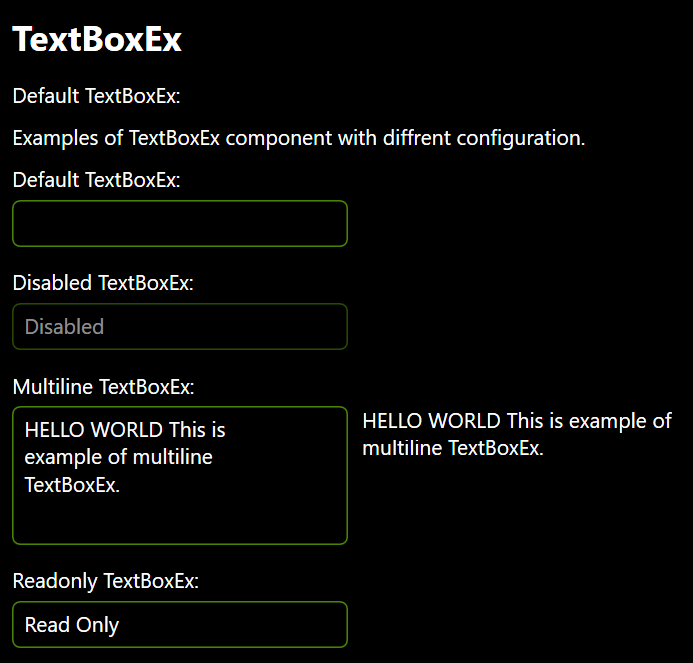

# TextBoxEx
Extended TextBox Control inherited from _TextBox_ and _INotifyPropertyChanged_.

namespace: _chkam05.Tools.ControlsEx_

### Additional Attributes:

| Type                  | Name                   | Description |
|:----------------------|:-----------------------|:------------|
| Brush                 | MouseOverBackground    | TextBoxEx background color when cursor is over. |
| Brush                 | MouseOverBorderBrush   | TextBoxEx border color when cursor is over. |
| Brush                 | MouseOverForeground    | TextBoxEx foreground color when cursor is over. |
| Brush                 | SelectedBackground     | TextBoxEx background color when is focused. |
| Brush                 | SelectedBorderBrush    | TextBoxEx border color when is focused. |
| Brush                 | SelectedForeground     | TextBoxEx foreground color when is focused. |
| Brush                 | SelectedTextBackground | TextBoxEx selected text background color. |
||||
| [TextBoxConversionType](TextBoxConversionType.md) | ConversionType | Value type to convert to for data validation. |
| CornerRadius          | CornerRadius           | TextBoxEx corner radius. |

### Additional Constructors:

- _None_

### Additional Events:

| Type                        | Name             | Description |
|:----------------------------|:-----------------|:------------|
| PropertyChangedEventHandler | PropertyChanged  | Event invoked after changing property. |
| TextModifiedEventHandler    | TextModified     | Event invoked after finishing text modification (Lost focus, Tab or Enter pressed). |

### Additional Methods:

- _None_
