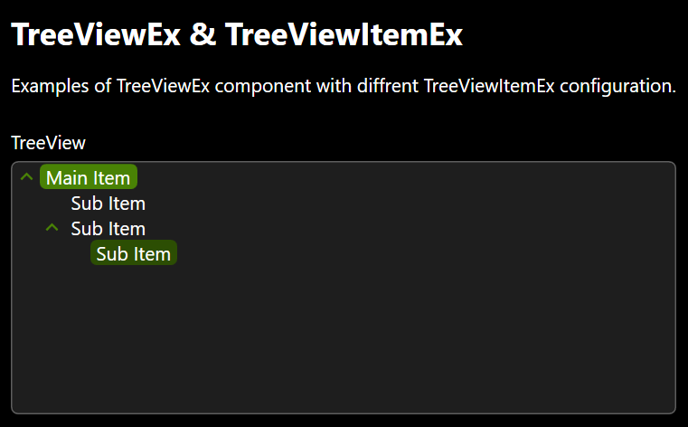

# TreeViewItemEx
Extended TreeViewItem Control inherited from _TreeViewItem_ and _INotifyPropertyChanged_.

namespace: _chkam05.Tools.ControlsEx_

### Additional Attributes:

| Type         | Name                            | Description |
|:-------------|:--------------------------------|:------------|
| Brush        | MouseOverBackground             | TreeViewItem background color when cursor is over. |
| Brush        | MouseOverBorderBrush            | TreeViewItem border color when cursor is over. |
| Brush        | MouseOverForeground             | TreeViewItem foreground color when cursor is over. |
| Brush        | SelectedBackground              | TreeViewItem background color when is selected. |
| Brush        | SelectedBorderBrush             | TreeViewItem border color when is selected. |
| Brush        | SelectedForeground              | TreeViewItem foreground color when is selected. |
| Brush        | SelectedInactiveBackground      | TreeViewItem border color when is selected without focus. |
| Brush        | SelectedInactiveForeground      | TreeViewItem foreground color when is selected without focus. |
| Brush        | ExpanderIconColorBrush          | TreeViewItem expander icon color. |
| Brush        | MouseOverExpanderIconColorBrush | TreeViewItem expander icon color when cursor is over. |
| Thickness    | ExpanderIconMargin              | TreeViewItem expander icon margin. |
||||
| CornerRadius | CornerRadius                    | TreeViewItem corner radius. |

### Additional Constructors:

- _None_

### Additional Events:

| Type                        | Name             | Description |
|:----------------------------|:-----------------|:------------|
| PropertyChangedEventHandler | PropertyChanged  | Event invoked after changing property. |

### Additional Methods:

- _None_

### Related components:

- [TreeViewEx](TreeViewEx.md)  
Is default container component for TreeViewItemEx component.
