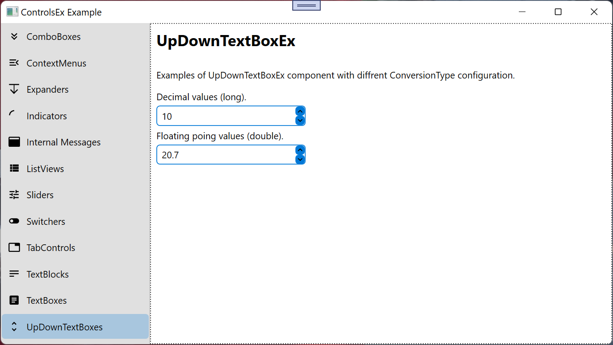

# UpDownTextBoxEx
UpDownTextBoxEx Control inherited from _[TextBoxEx](TextBoxEx.md)_ and _INotifyPropertyChanged_.

namespace: _chkam05.Tools.ControlsEx_

### Additional Attributes:

| Type         | Name                       | Description |
|:-------------|:---------------------------|:------------|
| Brush        | ButtonBackground           | UpDownTextBoxEx buttons background color. |
| Brush        | ButtonBorderBrush          | UpDownTextBoxEx buttons border color. |
| Brush        | ButtonForeground           | UpDownTextBoxEx buttons foreground color. |
| Brush        | ButtonMouseOverBackground  | UpDownTextBoxEx buttons background color when cursor is over. |
| Brush        | ButtonMouseOverBorderBrush | UpDownTextBoxEx buttons border color when cursor is over. |
| Brush        | ButtonMouseOverForeground  | UpDownTextBoxEx buttons foreground color when cursor is over. |
| Brush        | ButtonPressedBackground    | UpDownTextBoxEx buttons background color when is pressed. |
| Brush        | ButtonPressedBorderBrush   | UpDownTextBoxEx buttons border color when is pressed. |
| Brush        | ButtonPressedForeground    | UpDownTextBoxEx buttons foreground color when is pressed. |
| Brush        | MouseOverBackground        | UpDownTextBoxEx background color when cursor is over. |
| Brush        | MouseOverBorderBrush       | UpDownTextBoxEx border color when cursor is over. |
| Brush        | MouseOverForeground        | UpDownTextBoxEx foreground color when cursor is over. |
| Brush        | SelectedBackground         | UpDownTextBoxEx background color when is focused. |
| Brush        | SelectedBorderBrush        | UpDownTextBoxEx border color when is focused. |
| Brush        | SelectedForeground         | UpDownTextBoxEx foreground color when is focused. |
| Brush        | SelectedTextBackground     | UpDownTextBoxEx selected text background color. |
||||
| Thickness    | ButtonBorderThickness      | UpDownTextBoxEx buttons border thickness. |
| double       | ButtonHeight               | UpDownTextBoxEx buttons height. |
| double       | ButtonWidth                | UpDownTextBoxEx buttons width. |
||||
| [UpDownTextBoxConversionType](UpDownTextBoxConversionType.md) | ConversionType | UpDownTextBoxEx value type to convert to for data validation. |
| CornerRadius | CornerRadius               | UpDownTextBoxEx corner radius. |
| double       | MaxValue                   | UpDownTextBoxEx max value. |
| double       | MinValue                   | UpDownTextBoxEx min value. |
| double       | Tick                       | UpDownTextBoxEx value change tick via buttons. |

### Additional Constructors:

- _None_

### Additional Events:

| Type                        | Name             | Description |
|:----------------------------|:-----------------|:------------|
| PropertyChangedEventHandler | PropertyChanged  | Event invoked after changing property. |
| TextModifiedEventHandler    | TextModified     | Event invoked after finishing text modification (Lost focus, Tab or Enter pressed). |

### Additional Methods:

- _None_

# Related repositories

materialdesigninxaml (PackIconKind): https://github.com/MaterialDesignInXAML/MaterialDesignInXamlToolkit  
_Used in buttons_  
