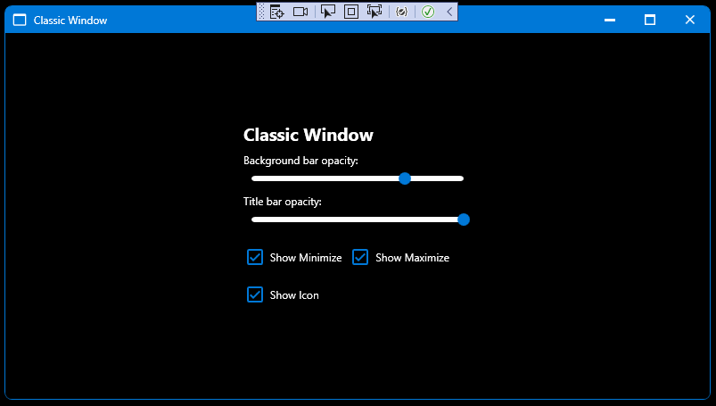

# WindowEx
Extended Window inherited from _[BaseWindowEx](BaseWindowEx.md)_.

namespace: _chkam05.Tools.WindowsEx_

### Additional Attributes:

| Type         | Name                                   | Description |
|:-------------|:---------------------------------------|:------------|
| Brush        | MouseOverTitleBarButtonBackground      | Titlebar buttons background color when cursor is over. |
| Brush        | MouseOverTitleBarButtonForeground      | Titlebar buttons foreground color when cursor is over. |
| Brush        | PressedTitleBarButtonBackground        | Titlebar buttons background color when are pressed. |
| Brush        | PressedTitleBarButtonForeground        | Titlebar buttons foreground color when is pressed. |
| Brush        | MouseOverTitleBarCloseButtonBackground | Titlebar close button background color when cursor is over. |
| Brush        | MouseOverTitleBarCloseButtonForeground | Titlebar close button foreground color when cursor is over. |
| Brush        | PressedTitleBarCloseButtonBackground   | Titlebar close button background color when are pressed. |
| Brush        | PressedTitleBarCloseButtonForeground   | Titlebar close button foreground color when is pressed. |
|||
| PackIconKind | MinimizeButtonIconKind | Titlebar minimize button Icon kind (see related repositories). |
| PackIconKind | MaximizeButtonIconKind | Titlebar maximize button Icon kind (see related repositories). |
| PackIconKind | CloseButtonIconKind    | Close button Icon kind (see related repositories). |
| bool         | ShowMinimizeButton     | Show minimize button. |
| bool         | ShowMaximizeButton     | Show maximize button. |
| double       | BackgroundOpacity      | Window background opacity (0.0d - 1.0d). |
| CornerRadius | CornerRadius           | Window corner radius. |
| PackIconKind | PackIconKind           | Window Icon kind (see related repositories). |
| bool         | ShowIcon               | Show window icon. |
| double       | TitleBarOpacity        | Titlebar background opacity. |
|||
| CornerRadius | CornerRadius         | Button corner radius. |
| [ContentSide](ContentSide.md) | ContentSide | Button content side in relation of Icon. |

### Additional Constructors:

- _None_

### Additional Events:

- _None_

### Additional Methods:

- _None_

# Related repositories

materialdesigninxaml (PackIconKind): https://github.com/MaterialDesignInXAML/MaterialDesignInXamlToolkit
