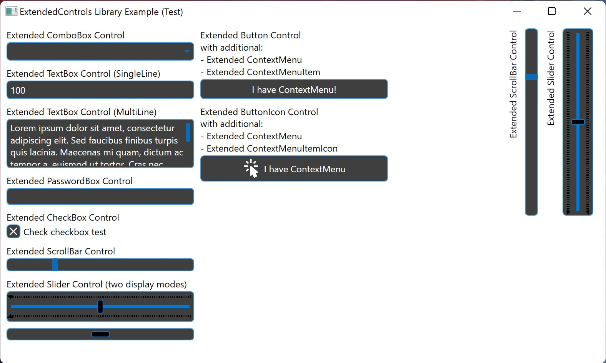

# DotNetTools.ExtendedControls
Extended controls for Windows Presentation Foundation environment

## List of controls:

- **ExtendedButton** 
- **ExtendedButtonIcon** (*button with PackIcon from MaterialDesignThemes*) 
- **ExtendedCheckBox** 
- **ExtendedComboBox** 
- **ExtendedContextMenu** 
- **ExtendedContextMenuItem** 
- **ExtendedContextMenuItemIcon** (*context menu item with PackIcon from MaterialDesignThemes*) 
- **ExtendedPasswordBox** 
- **ExtendedScrollBar** 
- **ExtendedSlider** 
- **ExtendedTextBox** 

## List of additional classes (data structures):

* **[Data.HslColor](Doc/Classes/HlsColor.md)** 
* **[Data.Static.IconPosition](Doc/Classes/IconPosition.md)** 
* **[Data.Static.InteractionBehaviour](Doc/Classes/InteractionBehaviour.md)** 
* **[Data.EventsModels.TextChangeEventArgs](Doc/Classes/TextChangeEventArgs.md)** 

## List of utilities:

* **[BrushColorRetriever](Doc/Utils/BrushColorRetriever.md)**
* **[ColorConverter](Doc/Utils/ColorConverter.md)**
* **[ColorShader](Doc/Utils/ColorShader.md)**
* **[NumericTextValidator](Doc/Utils/NumericTextValidator.md)**